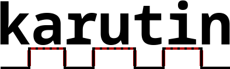

<div align="center">
    <br>
</div>

___

<div align="center">
    <b>Karutin</b> is a experimental coroutine crate that performs its own code lowering, <ins>without relying on async/await</ins>.<br>
	Main purpose of this crate is providing a funy experience of coroutines in stable Rust.
</div>

___

> [!WARNING]
> This is a experimental crate, not for productions!

> [!NOTE]
> For learning about how does this work,\
> what are the **cabalities** and **limitations (mutability, dropping)**,\
> please visit the <a href="https://docs.rs/karutin/latest/karutin/">documentation</a>!

Here are a few examples showing how to use Karutin below:\
<br>

### Fibonacci
Get the first 10 number of fibonacci sequence

```rust
use karutin::{KarutinGen, KarutinState, karutin};

karutin! {
    pub fn fibonacci() -> usize..() {
        let mut a = 0;
        let mut b = 1;

        for _ in 0..10 {
            yield a;
            let mut next = a + b;
            a = b;
            b = next;
        }
    }
}

fn main() {
    // Call the coroutine and get the context,
    // behind the scene, a variable stack created.
    let fibonacci_seq = fibonacci();

    // Resume the execution in iterator
    for state in fibonacci_seq.into_iter() {
	    match state {
            KarutinState::Yielded(v) => println!("Yielded: {v}!"),
            KarutinState::Returned(v) => println!("Returned: {v:?}!"),
            KarutinState::Completed => println!("Completed!"),
        }
    }
}
```

### Chars
Yield the chars of a string, and return its length

```rust
use karutin::{Karutin, KarutinState, karutin};

karutin! {
	pub fn chars(string: &String) -> char..usize {
		for mut ch in string.chars() {
			yield ch;
		}
		string.len()
	}
}

fn main() {
	let string = String::from("Hello World!");
    let mut chars = chars();

    loop {
	    match chars.resume(&string) {
            KarutinState::Yielded(v) => println!("Current char: {v}!"),
            KarutinState::Returned(v) => println!("String length: {v:?}!"),
            KarutinState::Completed => {
                println!("Completed!");
                break;
            },
        }
    }
}
```
